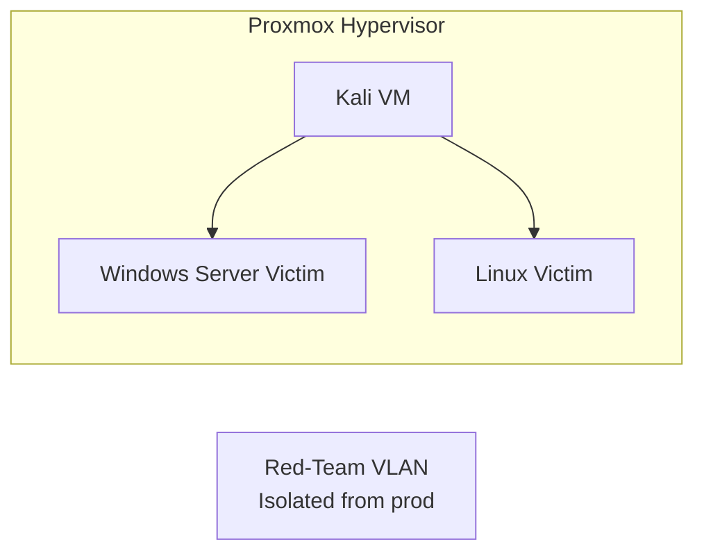

# Homelab Red-Team & Research Stack — Offensive Security Lab

> Kali Linux VM • Proxmox cloud-init • Legal/Ethics guardrails • Attack simulation scenarios

[](#license)


This repo defines the **red-team and research environment** inside the homelab. It’s isolated from production workloads and used for **learning, safe pentesting practice, and adversary emulation**.

---

## ✨ Highlights
- **Kali Linux VM** deployed via Proxmox cloud-init
- **Scenario library** (YAML-based attack simulations)
- **Legal & ethics guidelines** documented to enforce safe usage
- **Segregated VLAN** for red-team lab traffic
- **Snapshots & rollback** for safe resets

---

## 🧭 High-Level Architecture



---

## 📁 Repo Layout
```
redteam-research-stack/
├─ README.md
├─ .env.example
├─ proxmox/
│  └─ kali-vm/
│     ├─ cloud-init/
│     │  ├─ user-data
│     │  └─ meta-data
├─ scenarios/
│  ├─ sample.yaml
├─ docs/
│  ├─ LEGAL-ETHICS.md
│  ├─ ISOLATION.md
│  ├─ SNAPSHOTS.md
│  ├─ SCENARIOS.md
│  └─ TOOLING.md
└─ .gitignore
```

---

## 🚀 Quick Start

### Deploy Kali VM
1. Download latest Kali cloud image (QCOW2).
2. Upload to Proxmox storage.
3. Place `user-data` and `meta-data` files into `proxmox/kali-vm/cloud-init/`.
4. Create VM in Proxmox, attach cloud-init drive, boot.

### Run a Scenario
- Define attack flow in `scenarios/*.yaml`.
- Use Ansible or manual steps to simulate attack chains (phishing → persistence → lateral movement).

---

## 🔐 Safety & Isolation

- Red-team VLAN **isolated** from prod workloads.
- No internet exposure without explicit firewall rules.
- Snapshots before major operations.
- Reset to baseline after each run.

---

## 📊 Documentation

- **Legal/Ethics**: what is allowed, what is prohibited.
- **Isolation**: VLAN + firewall rules to keep testing safe.
- **Snapshots**: how to checkpoint & roll back labs.
- **Scenarios**: attack flows & YAML schema.
- **Tooling**: recommended pentest tools to install.

---

## 📌 Roadmap
- Add Atomic Red Team automation.
- Build more victim VM templates (Windows/Linux).
- Create dashboards to visualize attack chains vs detections.
- Integrate with SOC stack to validate detections.

---

## 📝 License
MIT — see `LICENSE`
